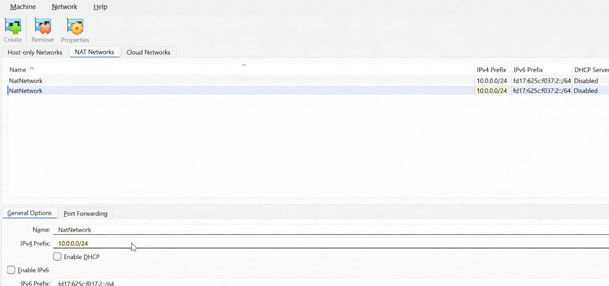
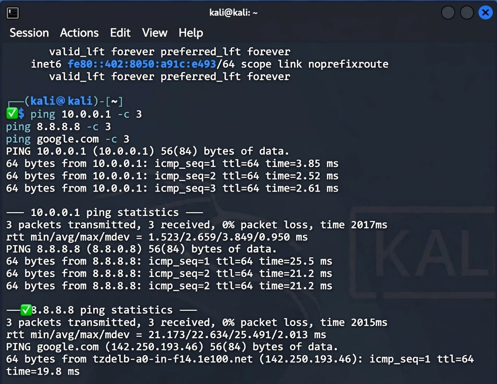
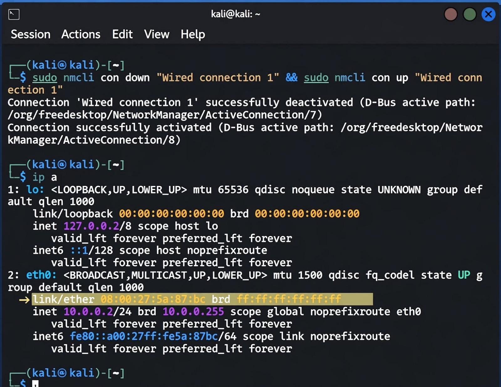
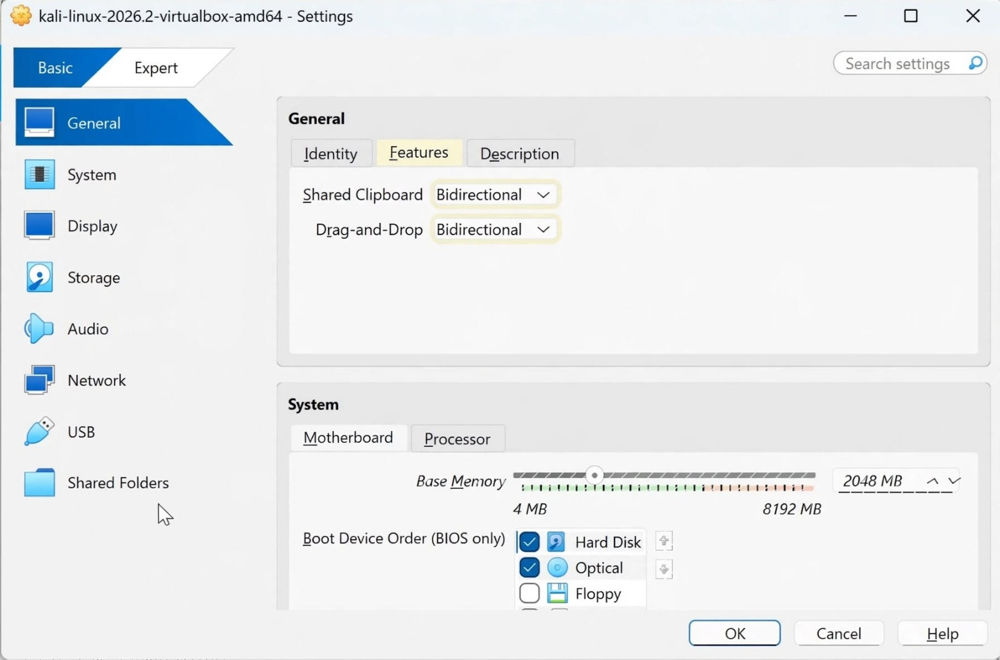
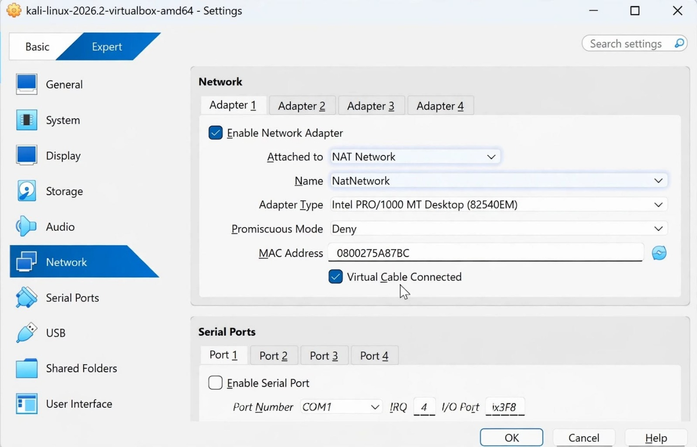

# NETWORKWALKS-B083-WK1-PM1-CYBERSECURITY-LAB-SETUP
Week 1 - Cybersecurity Lab Setup - VirtualBox + Kali Linux - Batch B083 - Rekha Kumari

### About
This is my Week 1 task for internship. I made a hacking lab using VirtualBox and Kali. This is first time I am doing this type of setup.

### What I used
- Windows 11 laptop
- VirtualBox 7.2.16
- Kali linux 2026.2 virtualbox image

### Step 1 - Download and Install
I download VirtualBox from virtualbox.org and 7-Zip to extract Kali file. VirtualBox install was easy, I just clicked next next.

Kali file was in .7z format, so I extracted it with 7-Zip and got .ova file.

### Step 2 - NAT Network Setup
As per task PDF we need NATNetwork 10.0.0.0/24.

I went to VirtualBox > File > Tools > Network Manager > NAT Networks > Click Create button.

I gave:
Name - NatNetwork
Network - 10.0.0.0/24
Gateway - 10.0.0.1
I unchecked DHCP because we need static IP later.

I took screenshot of this page. This was little confusing first time.

### Step 3 - Import Kali
Then I imported Kali. VirtualBox > File > Import Appliance > select .ova file > Import.

It took 5-6 minutes. After that Kali showed in left side list.

### Step 4 - Settings I did
Before starting I changed some settings as per task:

- System > Motherboard > Base Memory 2048 MB
- Processors > 2 CPUs
- General > Advanced > Shared Clipboard - Bidirectional
- General > Advanced > Drag and Drop - Bidirectional
- Network > Adapter 1 > Attached to NAT Network > Name NatNetwork

Also added shared folder:
My folder path is D:\Cyber Security Internship\NetworkWalks Share
I added it and gave name Share and checked Auto-mount.

### Step 5 - Issue I faced - VT-x and Network
When I started VM first time it said VT-x is disabled. I restarted my laptop and went to BIOS (pressing F2) and enabled Virtualization Technology. After that VM started.

Second issue - after booting, Kali had no internet. Wired connection showed disconnected. I went to Devices menu at top of VM window and checked Network > Connect Network Adapter. Also I clicked on network icon in Kali top right and enabled Wired connection. After that internet came.

### Step 6 - Static IP 10.0.0.2
We have to give static IP as per task.

I went to Kali settings > WiFi/Network > Wired > Settings icon > IPv4 tab > Manual

I entered:
Address - 10.0.0.2
Netmask - 255.255.255.0
Gateway - 10.0.0.1
DNS - 8.8.8.8

Then I opened terminal and ran:
ip a
It showed 10.0.0.2/24

Then I tested:
ping 10.0.0.1 - gateway working
ping 8.8.8.8 - internet working
ping google.com - DNS working

For me the nmcli dad-timeout command also helped when connection was not stable, I used it from task video comments.

### Step 7 - Shared Folder Check
After adding to vboxsf group:
sudo usermod -aG vboxsf kali

I restarted Kali and then checked:
ls /media/sf_Share
My files were showing. So sharing is working.

### Step 8 - Snapshot
I took snapshot. Machine > Take Snapshot > Name - Clean_Kali_Setup_Week1

So if anything breaks I can restore.

### Problems I faced (different from others)
1. VT-x disabled in BIOS - enabled from BIOS setup
2. Wired network disconnected at first - enabled from Devices menu
3. My laptop became slow when VM was running, so I closed other apps

### What I learned
- How to create NAT Network
- How to give static IP in Kali
- Importance of enabling virtualization in BIOS
- How to use snapshots
- How lab should be isolated

Thanks
Rekha Kumari
B083
## Screenshots

